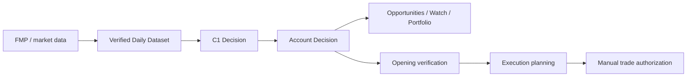

# C1 account architecture

The completed-session path is:

`deriveC1AccountAnalysis` is the authoritative account analysis. It derives completed carry records from accepted daily inputs, applies recorded executions and cash receipts, and runs the existing C1 strategy. Derived carry records are never saved by display reads. An open session overlays only already-posted fills; it does not project purchases or sales.

`GET /api/c1-account` and `POST refresh-analysis` return this same analysis. The removed compact/skip-pending alternatives do not select different account states. These requests neither collect opening prices nor write account data. Missing completed holding prices are verified in memory using the same private coverage checks; this does not save observations or refresh momentum ranks. Opportunities, Watch, and Portfolio use the same `decision`; opening actions attach a separate `executionDecision` and cannot replace completed holding guidance. An opening failure remains an execution error while the analysis stays visible.

`POST refresh-account-inputs` verifies private holding prices and momentum observations, retaining the former Portfolio refresh behavior and conditional storage writes. These supplemental observations never initialize or rewrite the daily index dataset. Portfolio analysis and Account settings explicitly request this verification before independently preparing execution.

`POST prepare-execution` starts the downstream opening path. It verifies market hours, adjusted prices, membership, account cash, sleeve limits, entry checks, price revisions, and recommendation expiry. `record-intraday` records broker-reported fills through the same safeguards. Historical trade entry and recovery remain downstream and cannot authorize a current purchase. No automatic brokerage execution is added.

Actual accounting lives in `c1AccountLedger`; live opening authority lives in `c1AccountExecution`. Shared deterministic session projection is used only to reconstruct older confirmed records without saved plan evidence and for downstream historical trade entry or parity checks. This preserves accepted historical order identities without treating a daily capture timestamp as a live opening observation. New completed intraday records retain their immutable server-generated execution evidence. Client session records cannot inject that evidence.

Cash, fees, actual sleeve ownership, original purchase dates, capital history, stops, cooldowns, and recorded entry/exit evidence remain authoritative. Date corrections compare economic ownership while retaining original execution evidence. Broker-cash adjustments retain the existing account-unit and strategy-risk treatment; replay applies them once. Frozen simulators, momentum ranking, the three sleeves, and trading policy are unchanged.

The release-freeze and canonical integrity guards remain in both build and verification. One runner discovers every regression script, executes each in its own process, runs the trade simulation, and fails the release on any failure. The obsolete V11 forwarding wrapper, duplicate nested invocations, and unused source-patching scripts are removed. Date-dependent IRDM expectations use fixed clocks on both sides of the unchanged merger hurdle. The held-close fixture now runs offline; its archived audit mode remains available, and expectations follow the previously authorized append-only provider reconciliation rule.
